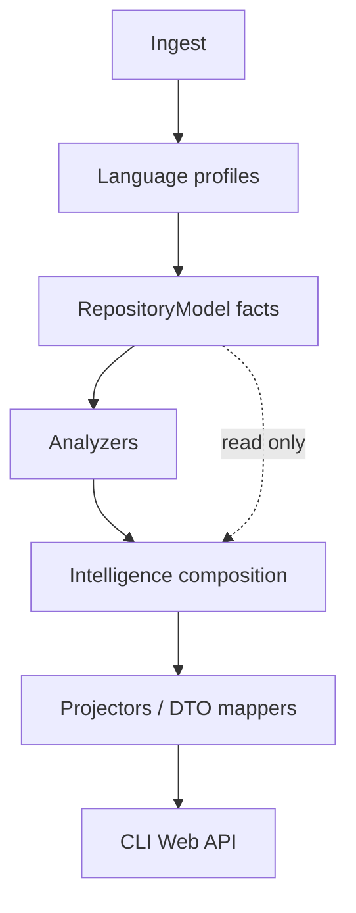

# RepoLens v1.7 Architecture Specification

**Theme:** Repository Intelligence & Traceability
**Status:** Proposed architecture (not implemented)
**Date:** 2026-09-13
**Baseline:** RepoLens **v1.6.0** (released)

This document defines what v1.7 *should* become. It is not a commitment to ship every
section in a single release, and it does not describe current product behavior except
where explicitly marked **v1.6**.

Versions after 1.6 in the product narrative
(`v1.8` AI explanations / workflows, `v2.0` multi-client platform) are **illustrative
only**. They are not implementation plans.

---

## 1. Purpose

v1.6 made repository **structure** inspectable: modules, symbols, selected
relationships, and evidence-backed diagrams. Users can see *what exists* and *how
packages and types relate*, with honest empty states when evidence is missing.

v1.7 exists to answer a different class of questions: *how behavior is connected*.

Typical questions:

- What HTTP endpoints does this repository expose?
- Which type and method handle a given route?
- Which services, repositories, and persistence types sit on that path?
- Which tests appear related to a class, method, or endpoint?
- What would likely be affected if this component changed?
- **Why** does RepoLens believe a given connection exists?

The architectural problem is not “more diagrams.” It is to introduce **traceable
derived intelligence** without:

- inventing relationships,
- mixing raw facts with guesses,
- moving intelligence into the Web UI,
- or replacing the v1.6 modular monolith.

---

## 2. v1.7 Definition

In RepoLens, **repository intelligence** is deterministic, static, evidence-backed
composition of repository facts into answers about connectivity, impact, and
provenance. It is not runtime tracing, not a compiler, and not an LLM.

| Layer | Meaning | Example |
|-------|---------|---------|
| **Repository facts** | Observations stored on `RepositoryModel` (or additive fact types) that come from ingest/parse | File path, `Symbol` name/kind, `package` module, `@GetMapping` capture |
| **Structural relationships** | Typed edges between fact entities | `EXTENDS`, `IMPLEMENTS`, `DEPENDS_ON`, `CALLS` |
| **Derived intelligence** | Views composed from facts and relationships | Endpoint→handler→service **trace**, impact set for a symbol |
| **Evidence / provenance** | Inspectable reason an edge or view exists | Annotation at `OwnerController.java:42`; CALLS `confidence=high` via field type |

Rules:

1. Facts must remain queryable without derived views.
2. Derived views must cite facts/relationships; they must not become a second source of truth.
3. Absence of evidence is a valid result (`unknown` / empty), not a prompt to invent.

---

## 3. v1.6 Baseline

v1.7 **extends** the shipped v1.6 engine. v1.6 is complete for its theme (analysis
quality and reliable diagrams). Gaps below are *out of v1.6 scope*, not defects of
the release.

### 3.1 Pipeline (implemented)

```
Repository
    → Ingestion (local path; Web/API: public GitHub HTTPS)
    → Language profiles / parser (Tree-sitter when natives load, else structural fallback)
    → RepositoryModel
    → Analyzers (structure, dependency, type-dependency, metrics)
    → GraphViewProjector / DiagramProjector
    → CLI · Web API · packaged Web UI
```

This remains a **modular monolith** (ADR-001). Spring Boot is not used (ADR-005).
Jobs are in-memory and ephemeral (ADR-006). External JSON uses `schemaVersion = v1`
and routes under `/v1/...` (ADR-007). Analyzers must not parse source (ADR-004).
AI explanation is an optional port (ADR-008) and is **not implemented**.

### 3.2 `RepositoryModel` (implemented)

Canonical types today: `Repository`, `SourceFile`, `Module`, `Symbol`, `Import`,
`ExternalDependency`, `Relationship`, `Metric`, documentation types,
`RepositoryMetadata`, `StructuralFact`.

Also present today (not new for v1.7):

- `SourceLocation` — file path plus optional 1-based span (`0` means unknown).
- `Relationship.confidence` (`0.0`–`1.0`) and `Relationship.provenance` (`Optional<String>`).
- `SymbolKind`: CLASS, INTERFACE, ENUM, FUNCTION, METHOD, FIELD, TYPE, OTHER.
- `RelationshipType`: CONTAINS, IMPORTS, EXTENDS, IMPLEMENTS, DEPENDS_ON, CALLS.

**Not present as types:** `Endpoint`, `Test`, `Evidence` (structured),
`RepositorySession`, language plugin SDK, renderer module, VS Code / MCP / product
GitHub Action.

### 3.3 Parsing and structural facts (implemented)

`LanguageProfile` + `ProfiledSourceAnalyzer` populate the model. Java-oriented
extractors under `repolens-parse/.../structural/` emit `StructuralFact`s for
sequence roles, JPA, Spring mappings (as **use-case** facts with `route=` detail),
CALLS, activity, state, deployment, and config.

CALLS: heuristic; `high` typed/static receiver, `medium` name heuristic;
below emit threshold → no edge (`CallConfidence`). Provenance is a **string**
(e.g. `call:save;confidence=high`).

### 3.4 Analyzers and projectors (implemented)

Analyzers: `StructureAnalyzer`, `DependencyAnalyzer`, `TypeDependencyAnalyzer`,
`MetricsAnalyzer`.

Projectors: `GraphViewProjector` (architecture / package / class graphs),
`DiagramProjector` (sequence, ER, DFD, activity, deployment, use case, state).
Sequence diagrams **omit** types whose names look like tests (`*Test`); that is
filtering, not a Test model.

### 3.5 Consumers (implemented)

- CLI: `ingest`, `analyze` (local paths), `serve`.
- HTTP: `POST /v1/analyze`, `GET /v1/jobs/{id}`, `.../result`, `.../graph`.
- Web UI: Cytoscape explorer, client-side filters, inspector; consumes API DTOs.

### 3.6 Relevant limitations (unchanged unless v1.7 addresses them)

Heuristic CALLS; sequence ≠ runtime; activity ≠ full CFG; specialized diagrams may
be empty; clone cache is reuse-only; Java is the only language with inheritance
and CALLS extraction; Spring routes exist as use-case **facts**, not endpoints.

---

## 4. v1.7 Architectural Direction

**Proposed** pipeline (logical layers in the same modular monolith):

```
Repository
    → Ingestion
    → Language profiles / parser
    → RepositoryModel          # facts (+ additive endpoint/test facts)
    → Analyzers
         ├── existing structural / dependency / metrics
         └── proposed: endpoint, test, call-quality, trace, impact
    → Intelligence composition   # traces, impact, dependency explanations
    → Projection                 # GraphView, diagrams, JSON DTOs, CLI text
    → CLI / Web / API
```



Implications:

- No new deployable, no required database, no microservices.
- Intelligence lives in **engine modules** (`repolens-parse` for language-specific
  extraction; `repolens-analyzers` for composition). Prefer packages over a new
  Gradle module until a boundary is forced.
- `repolens-web` / `repolens-cli` / `repolens-web-ui` remain thin adapters.
- Do **not** introduce `RepositorySession` or a plugin SDK for v1.7 unless a later
  design proves the current ports insufficient. Those remain **future possibilities**.

---

## 5. RepositoryModel Evolution

Principle: **additive**. Do not break v1.6 consumers. Do not dump every derived
view onto `RepositoryModel`.

| Concept | Status | Fact vs derived | Proposed home |
|---------|--------|-----------------|---------------|
| `SourceLocation` | **Exists in v1.6** | Fact (span may be unknown) | Keep on `Symbol` / facts; reuse for endpoints/tests |
| `Relationship` + confidence/provenance | **Exists** | Relationship; provenance is a string | Evolve provenance toward structured evidence **additively** |
| `StructuralFact` | **Exists** | Fact used by diagrams | Keep; Spring `usecase` facts are a precursor, not an Endpoint type |
| Endpoint | **Proposed** | Fact when annotation/convention is captured | Model collection populated at parse/extract time |
| Test | **Proposed** | Fact (discovery) + derived links | Discovery at parse; links via analyzers |
| Structured Evidence | **Proposed** | Metadata on relationships / traces | Shared value type; not a parallel graph |
| Trace / Impact | **Proposed** | Derived intelligence | Analyzer / intelligence output, **not** duplicated as core facts |

### 5.1 Endpoint (proposed)

- **Purpose:** First-class HTTP (or similar) operation the repository exposes.
- **Concepts:** method, path, owning type, handler method id, optional parameters /
  return type as *captured text*, source location, framework evidence id.
- **Fact vs derived:** The endpoint *declaration* is a fact. Handler→service hops
  are derived (trace).
- **Ownership:** Extractors in `repolens-parse` (language/framework-specific).
  Analyzers must not re-parse annotations from source (ADR-004).
- **Relation to model:** New ids referenced by relationships (`HANDLES`, later
  types) and by traces. May initially be stored as typed `StructuralFact`s if a
  full type is premature—**prefer a real `Endpoint` type** once fields stabilize,
  to avoid stringly-typed `detail` maps.
- **Must not include:** Runtime traffic, authz decisions, OpenAPI generation as
  a required product, or “complete Spring MVC coverage.”

### 5.2 Test (proposed)

- **Purpose:** Identify test types/methods and relate them to production symbols
  when CALLS/imports support it.
- **Concepts:** test framework hint (e.g. JUnit), symbol id, file location,
  inferred subjects (symbol ids) with confidence.
- **Fact vs derived:** “This method is annotated `@Test`” is a fact.
  “This test exercises `OwnerController.processFindForm`” is inferred.
- **Ownership:** Discovery in parse/extractors; subject linking in analyzers.
- **Must not include:** Coverage percentages, flakiness, or guaranteed behavioral
  equivalence to the named production method.

### 5.3 SourceLocation (existing → evolve)

- **Purpose:** Point users at evidence.
- **v1.6:** `filePath`, start/end line/column; zeros mean unknown.
- **v1.7:** Reuse for endpoints, tests, and evidence items. Do not invent a second
  location type. Optional: require non-zero line when the extractor actually saw
  a match offset (already true for many `StructuralFact.line`s).
- **Must not include:** Full source text blobs in the model (keep snippets in
  projection/inspector if needed, with redaction policy from ADR-010).

### 5.4 Evidence / provenance (proposed)

- **Purpose:** Make inference inspectable.
- **Concepts:** `inferenceMethod`, optional `sourceLocation`, optional `excerpt`
  or fact id, `confidence`, free-text `summary` for CLI/UI.
- **Fact vs derived:** Evidence describes *why* a relationship or view exists; it
  is not itself a graph node.
- **v1.6 bridge:** Today `Relationship.provenance` is `Optional<String>`. v1.7
  should parse-compatible evolve (keep string for old JSON; add structured field
  in DTOs as optional).
- **Must not include:** Opaque model-provider citations or “the LLM said so.”

### 5.5 Relationship improvements (proposed)

Possible additive `RelationshipType` values (names illustrative): `HANDLES`
(endpoint→method), `TESTS` (test→subject), `INJECTS` only if evidence is
annotation/field typed—not name-only.

Do not explode the enum for every framework idiom. Prefer evidence methods +
existing `CALLS` / `DEPENDS_ON` when that is sufficient.

---

## 6. Evidence and Provenance

Every emitted relationship and every trace hop **should** carry:

| Field | Role |
|-------|------|
| Relationship / hop type | What is claimed |
| Confidence | How strongly the engine believes it (`0–1` or labeled bands) |
| Inference method | How it was obtained |
| Source location | Where to look in the repo |
| Evidence | Fact id, annotation text, or short excerpt |

**Proposed inference methods** (closed set, extend carefully):

| Method | Typical use |
|--------|-------------|
| `ast_capture` | Tree-sitter or fallback capture (`extends`, field) |
| `annotation` | `@GetMapping`, `@Entity`, `@Test` |
| `type_resolution` | CALLS via field/constructor/setter type (`CallConfidence.HIGH`) |
| `name_heuristic` | Capitalized receiver matches a type (`MEDIUM`) |
| `framework_convention` | Type name ends with `Controller` / `Service` **only as supporting**, not sole CALLS evidence |

**Confidence is not proof.** UI/CLI must not present `high` as “verified at runtime.”

Prefer:

- omit the edge (v1.6 CALLS policy below `MIN_EMIT`), or
- emit an **unresolved** placeholder in a trace (`unknown hop`),

over a confident invented link.

Framework convention (e.g. `*Service`) may label a **role** (already done for
sequence facts) but must not, by itself, create CALLS or trace hops.

---

## 7. Endpoint Intelligence

**Proposed.** First implementation target: **Java / Spring MVC** annotations
already partially scanned by `SpringStructuralFactExtractor`.

### 7.1 Conceptual fields

| Field | Notes |
|-------|--------|
| HTTP method | GET/POST/… when the annotation distinguishes it; `UNKNOWN` if only `@RequestMapping` without method |
| Path | Combined class + method mapping (v1.6 already combines class prefix + method path for use cases) |
| Controller type | `Symbol` id when resolved |
| Handler method | `Symbol` id when the mapping is on a method; else unresolved |
| Parameters / return type | Optional captured signatures; omit rather than guess |
| Location | Annotation / method `SourceLocation` |
| Framework evidence | e.g. `annotation:@GetMapping` |

### 7.2 Spring evidence (non-exhaustive)

In-scope for a first slice: `@RestController` / `@Controller`, class-level
`@RequestMapping`, method `@GetMapping` / `@PostMapping` / `@PutMapping` /
`@DeleteMapping` / `@PatchMapping` / `@RequestMapping`.

Explicitly incomplete unless later scoped: WebFlux routers, functional endpoints,
servlet `web.xml`, JAX-RS, Spring GraphQL, gateway routes, inherited mappings
across superclasses without a capture, SpEL paths.

v1.6 use-case diagrams humanize routes (`New`, `Find`) and may omit HTTP method.
v1.7 endpoints should keep the **raw path** and method as facts; human labels are
projection.

If no Spring (or equivalent) evidence exists, the endpoint list is **empty**. That
is success, not failure.

---

## 8. Test Intelligence

**Proposed.** v1.6 only filters `*Test` names out of sequence diagrams.

### 8.1 Discovery (facts)

Java-first signals (any one may suffice, with documented confidence):

- Method or type annotations: `@Test`, `@ParameterizedTest`, `@Nested` (JUnit 5),
  JUnit 4 `@Test` where captured.
- Type name / file name: `*Test`, `*Tests`, `*IT` as **weaker** discovery if
  annotations are missing.

### 8.2 Linking (derived)

Potential edges: Test → production method/class; Test → controller; Test →
endpoint (only if CALLS/HANDLES chain exists).

Mechanisms: CALLS from test methods into production types; imports; Spring
`@WebMvcTest` / `@SpringBootTest` **only if extracted as facts**—do not parse
test source inside analyzers.

### 8.3 Limitations

Static analysis **cannot** guarantee what a test executes (reflection, Mockito
`verify`, `@Sql`, HTML templates, `MockMvc` string URLs without a matching
endpoint fact). Unlinked tests must remain listable as tests with
`subjects = []` rather than forced matches.

---

## 9. Trace Intelligence

**Proposed.** A v1.7 **trace** is a statically inferred path through repository
code and facts.

Example shape (Java/Spring when evidence exists):

```
Endpoint → Controller type → Handler method → CALLS → Service → CALLS → Repository → JPA entity
```

### 9.1 What a trace means

“RepoLens composed these hops from facts and relationships that met emit
thresholds.” It is a **hypothesis graph path**, useful for navigation.

### 9.2 What it does not mean

- Not runtime execution or a recorded call stack.
- Not “this always happens in production.”
- Not completeness (missing CALLS ⇒ shorter or broken path).

### 9.3 Confidence propagation (proposed)

Trace confidence = **minimum** hop confidence along the path (weakest link).
Each hop retains its own evidence. Do not average away a `medium` hop.

Unresolved hop: stop the path or emit `unresolved` node; **do not** skip to a
same-named type in another package.

### 9.4 Avoiding false-positive traces

- Reuse CALLS emit threshold; do not add convention-only controller→service edges
  (v1.6 sequence projector already refuses role-only edges).
- Cap path length and fan-out (mirrors diagram `MAX_NODES` / `MAX_EDGES` spirit).
- Exclude test types as production hops unless the user asked for a test trace.
- One endpoint → many traces: return a ranked, capped list, not a combinatorial
  explosion.

---

## 10. Impact Analysis

**Proposed.** For a selected entity id (symbol, endpoint, or test), return
**relevant dependents and dependencies** with evidence tags.

| Category | Typical evidence |
|----------|------------------|
| Callers | Incoming `CALLS` |
| Dependents | Incoming `DEPENDS_ON` / `IMPORTS` / `EXTENDS` / `IMPLEMENTS` |
| Endpoints | Endpoints whose traces include the entity |
| Tests | Incoming inferred `TESTS` |
| Data models | JPA facts / ER entities reachable via CALLS or associations |
| Configuration | Existing deployment/config facts that name the type (if any) |

**Direct impact:** edges present on `RepositoryModel` (and endpoint/test facts)
with locations.

**Inferred impact:** composed (e.g. “tests that call a caller of this method”).
Must be labeled inferred and capped.

This is **not** semantic change-impact (no bytecode, no compiler, no git diff
analysis required for v1.7). Configuration impact is best-effort.

---

## 11. Analyzer Boundaries

Keep ADR-004. Language syntax stays in parse/profiles/extractors.

| Component | Responsibility | Must not |
|-----------|----------------|----------|
| Structural extractors (parse) | Captures, CALLS, JPA, Spring mappings, test annotations | UI formatting |
| Existing analyzers | Structure/deps/metrics as today | Grow into mega-analyzers |
| Endpoint analyzer | Normalize extract facts → Endpoint records / AnalysisResult | Regex over raw source |
| Test analyzer | Normalize test facts; link subjects from relationships | Claim coverage |
| Call/relationship analyzer | Optional CALLS quality reports; no duplicate emit of parse CALLS | Second parser |
| Trace builder | Compose paths from endpoints + CALLS + roles | Invent hops |
| Impact analyzer | Reverse indexes over relationships + traces | Full program slice |

Trace builder and impact analyzer are **composition services**. They may be
`Analyzer` implementations or a small collaborator used by the runner; they
must only read the model plus prior analyzer output, never files.

---

## 12. Intelligence Layer

**Why separate from raw structure:** Traces and impact are **views**. If stored
as additional `Relationship`s without provenance, the model becomes circular and
undebuggable.

**Proposed contract:**

- Parse writes facts (including proposed Endpoint/Test facts).
- Analyzers may add relationships that are still “graph of the repo.”
- Intelligence composition produces **result objects** (trace lists, impact
  reports) attached to the analysis run / DTO, analogous to `NamedDiagram` /
  `GraphView` today.

Do not copy every `Symbol` into a parallel “intelligence model.”

---

## 13. Projection Layer

v1.6 projectors already exist. v1.7 should **extend** DTO mapping and, if useful,
add diagrams **only** when they display new facts (e.g. endpoint list is a table
or graph, not ten new diagram kinds).

| Consumer | Projection |
|----------|------------|
| JSON/API | Additive fields or nested resources on the analysis job (see §14) |
| CLI | Human summaries + existing `--json` |
| Web UI | Explorers that bind to API fields |

The Web UI **must not** infer endpoints from node labels. If the API has no
endpoints, the UI shows empty.

`GraphView` javadoc already says renderers consume the view; that refers to
projection consumption, **not** a separate renderer module. Do not add a plugin
renderer SDK in v1.7.

---

## 14. API Implications

**Proposed only.** Subject to design; not part of v1.6.

Possible additive routes (same job id, same ephemeral store):

```
GET /v1/jobs/{id}/endpoints
GET /v1/jobs/{id}/tests
GET /v1/jobs/{id}/traces
GET /v1/jobs/{id}/impact/{entityId}
```

Alternatively, include optional arrays on `GET /v1/jobs/{id}/result` (backward
compatible empty lists, as `documentation` / `symbols` / `diagrams` already
default empty).

ADR-007: keep `schemaVersion = v1` if changes are additive; bump only for
breaking DTO changes. Do not expose parse/Tree-sitter types.

---

## 15. CLI Implications

**Proposed only.** CLI stays a thin adapter over the same runner.

Illustrative commands (names not frozen):

```
analyze <local-path> --json          # existing; may grow JSON fields
endpoints <local-path>
tests <local-path>
trace <local-path> [--endpoint PATH]
impact <local-path> --entity <id>
```

Remote GitHub ingest remains Web/API unless CLI later reuses the same ingestor
explicitly. Do not imply new CLI remotes as a v1.7 requirement.

---

## 16. Web UI Implications

**Proposed product capabilities**, not component design:

- Endpoint explorer (method, path, handler, evidence).
- Test explorer (tests, inferred subjects, confidence).
- Trace explorer (path with per-hop evidence; disclaimer: static, not runtime).
- Impact view for the selected inspector entity.
- Richer entity detail (locations, provenance strings already partly in CALLS).
- Navigation to source location (path + line; editor integration is **out of
  scope**—see §20).

Existing v1.6 diagrams and filters must keep working.

---

## 17. Language Strategy

| Tier | Languages | v1.7 depth |
|------|-----------|------------|
| **1** | Java / Spring / JPA | Endpoints, tests, CALLS, traces, persistence facts |
| **2** | JavaScript, TypeScript, Python, Go, Rust, C#, Kotlin | Existing PARTIAL structure; intelligence **only** where facts exist |
| **3** | Unsupported / no profile | Inventory only; **no fabricated** endpoints, tests, or traces |

Do not claim language parity. A Go repository in v1.7 should still produce v1.6
structure and empty endpoint/trace lists unless a later profile adds facts.

---

## 18. Java-First v1.7 Strategy

Java/Spring/JPA already have the deepest extractors and the richest diagrams.
Endpoint and test intelligence can land there first with real evidence.

The **architecture** stays language-agnostic:

- `Endpoint` / `Test` types and trace composition must not import Spring types.
- Framework knowledge stays in `repolens-parse` profiles/extractors.
- Analyzers see ids, relationship types, and evidence enums.

A future Python/FastAPI extractor could populate the same `Endpoint` shape
without changing impact/trace algorithms.

---

## 19. v1.7 Scope

**Proposed core (model):** Endpoint, Test, reuse/evolve `SourceLocation`,
structured evidence, conservative relationship additions.

**Proposed analysis:** Spring endpoint extraction (beyond use-case labels),
Java test discovery + inferred subjects, CALLS quality (same heuristic family,
better evidence, not a compiler), endpoint-to-code traces, impact over existing
edges + traces.

**Proposed consumers:** Additive API, CLI subcommands or `analyze --json`
fields, Web explorers.

**Not required to call the architecture “complete”:** every Spring feature,
multi-language endpoints, new diagram gallery, persistent jobs, AI.

---

## 20. Explicitly Out of Scope

- VS Code extension, MCP server, product GitHub Action
- Full AI agent; AI as a hidden analysis dependency (ADR-008 remains optional/future)
- Runtime tracing, APM, telemetry platforms
- Compiler replacement / complete Java semantic analysis / SCIP-as-foundation
- Microservices rewrite; database-first redesign
- Uncontrolled new diagram types
- Universal language parity
- `RepositorySession`, generalized language plugin SDK (future possibilities only)
- Reintroducing removed features (including Context Studio)
- Clone-cache freshness, multi-arch Tree-sitter natives (separate from this theme)

---

## 21. v1.6 → v1.7 Migration Strategy

| Area | Strategy |
|------|----------|
| `RepositoryModel` | Additive collections/types; keep existing constructors/builders working |
| API | Optional DTO fields defaulting to empty; new GET routes only after mapper exists; `schemaVersion` stays `v1` until a break |
| Analyzers | Keep the four v1.6 analyzers; add new ids rather than overloading `structure` |
| Diagrams | Do not break v1.6 diagram types; use-case diagrams may later *consume* Endpoint facts instead of parallel route strings |
| Web UI | Feature-detect empty arrays; no client-side Spring parsing |
| CLI | Old `analyze` output remains valid; new commands optional |
| Tests | Fixture `RepositoryModel`s for new analyzers; do not require live Spring apps for unit tests |
| Jobs | Same in-memory store; larger JSON payloads need size awareness |

If Endpoint starts as `StructuralFact` category `endpoint`, provide a documented
migration to a typed collection before UI depends on `detail` string parsing.

---

## 22. Acceptance Criteria

Architecturally testable (implementation would add tests; none of this is true yet):

1. Endpoint records are produced in parse/analyzers, not in `repolens-web-ui`.
2. Each emitted endpoint relationship/hop includes evidence (method + location or explicit `unknown` location).
3. Test→code links are marked inferred when not annotation-direct.
4. Trace payloads include a static-only disclaimer field or documented contract; no “executed” wording.
5. Impact results distinguish direct edges vs composed inference.
6. v1.6 diagram types still project on repositories that have no endpoints.
7. Repositories without Java/Spring produce empty endpoint/trace lists without dummy nodes.
8. CLI `--json`, Web `/v1/jobs/{id}/result`, and any new routes share `repolens-api-model` types.
9. Core intelligence runs with AI disabled (no provider required).
10. ArchUnit boundaries unchanged: analyzers must not depend on Tree-sitter or parse internals.
11. CALLS below emit threshold still omit edges (no regression to “guess anyway”).
12. No new Gradle module is *required* to land the first slice (packages first).

---

## 23. Architectural Risks

| Risk | Mitigation |
|------|------------|
| False-positive CALLS / traces | Keep emit threshold; min-confidence on paths; cap fan-out |
| Framework convention ambiguity | Roles ≠ CALLS; annotation-first for endpoints |
| Trace explosion | Max depth/width; per-endpoint cap; omit tests from prod traces |
| Model bloat | Derived views off-model; avoid duplicating symbols |
| Duplicated derived data | Single composition step; projectors read results, don’t recompute ad hoc in UI |
| Confidence misuse | UI labels (`high` / `medium` / `inferred`); never “verified” |
| Language inconsistency | Empty lists for Tier 2/3; matrix in LANGUAGE_SUPPORT |
| Large-repo performance | Existing fact/graph caps; impact indexes built once per job |
| API compatibility | Additive JSON; ADR-007 bump only on breaks |

---

## 24. Non-Goals

v1.7 does not try to:

- Prove runtime behavior or replace a debugger.
- Be a Java compiler or IDE.
- Attribute blame or security CVEs.
- Auto-generate architecture from an LLM.
- Equalize all languages.
- Host a multi-tenant intelligence platform (possible later narrative, not this spec).

---

## 25. Definition of Done (architecture)

v1.7 architecture is **done** when:

1. This spec’s boundaries are reflected in ADRs or an accepted follow-on ADR
   (Endpoint/Test/evidence) **before** large implementation.
2. Facts vs traces vs impact are separate types in the design (even if the first
   code slice is small).
3. Java/Spring endpoint extraction has a documented evidence set and explicit
   incompleteness list.
4. Consumers (CLI/API/UI) are specified as projections of one analysis run.
5. v1.6 diagrams, ingest, and `schemaVersion v1` additive compatibility are
   preserved in the plan.
6. Out-of-scope items in §20 remain out of the v1.7 implementation plan.

Shipping a subset (e.g. endpoints + evidence without impact) can still be a valid
*product* increment if it obeys these boundaries. Full §19 scope is not required
for a first merge.

---

## Document control

- **Does not implement** any v1.7 feature.
- **Does not** change ADRs’ historical decisions; new work should add ADRs.
- Aligns with ADR-001–011, `REPO_LAYOUT.md`, `LANGUAGE_SUPPORT.md`, README,
  `PROJECT_STATUS.md`, and ROADMAP (ROADMAP “Next” items such as AI explanations
  and clone freshness remain **separate** from this theme).
)