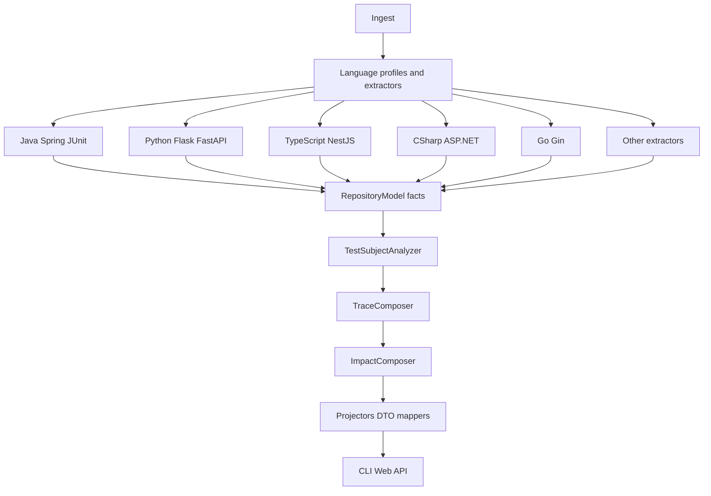

# RepoLens v1.8 Architecture Specification

**Theme:** Multi-language repository intelligence
**Status:** Proposed architecture (not implemented)
**Date:** 2026-09-14
**Baseline:** RepoLens **v1.7** intelligence (Java/Spring first) on the v1.6 modular monolith

This document defines what v1.8 *should* become. It is not a commitment to ship
every extractor in a single release. It does not describe current product
behavior except where marked as **v1.7 / QA**.

Related:

- [V1.7_INTELLIGENCE_SPEC.md](V1.7_INTELLIGENCE_SPEC.md)
- [ADR-012](../adr/ADR-012-repository-intelligence-domain-model.md)
- [ADR-013](../adr/ADR-013-multi-language-intelligence-architecture.md)
- [LANGUAGE_CAPABILITY_MATRIX.md](LANGUAGE_CAPABILITY_MATRIX.md)
- Structural language coverage remains in [LANGUAGE_SUPPORT.md](LANGUAGE_SUPPORT.md)

---

## 1. Purpose

v1.7 made **repository intelligence** inspectable for Java/Spring: canonical
`Endpoint` and `Test` facts, inferred `TESTS` relationships, static traces, and
derived impact — composed from `RepositoryModel`, not invented in the UI.

Completed multi-language QA showed a split:

| Stack | Structure | Intelligence (endpoints / tests / traces) |
|-------|-----------|---------------------------------------------|
| Java / Spring | Working | Working (Endpoint + Test + TESTS + Trace) |
| Python / Flask | Working | Currently 0 |
| Go / Gin | Working | Currently 0 |
| TypeScript / NestJS | Working | Currently 0 |
| C# / .NET | Working | Currently 0 |
| Rust / Axum | Working | Currently 0 |

v1.8 exists to **extend the same intelligence contract** to additional
languages and HTTP frameworks **without** forking the engine.

Typical questions remain those of v1.7, now asked of a Flask, NestJS, Gin, or
ASP.NET repository as honestly as of Spring:

- What HTTP endpoints does this repository declare?
- Which type/function handles a given route?
- Which tests appear related?
- What static path can be composed from existing CALLS?
- Why does RepoLens believe a connection exists?

The architectural problem is not “a Python intelligence engine.” It is to keep
**one canonical model** and **one composition pipeline**, with
language/framework knowledge confined to parse/extractors.

---

## 2. v1.8 Definition

In RepoLens, **multi-language intelligence** is the same deterministic, static,
evidence-backed composition defined in v1.7, populated by **additional
extractors** that emit the **same fact types**.

| Layer | Owner | Example |
|-------|-------|---------|
| Language/framework extraction | `repolens-parse` profiles/extractors | Flask `@app.route`, Nest `@Get`, Gin `GET`, ASP.NET `[HttpGet]` |
| Canonical facts | `RepositoryModel` | `Endpoint`, `Test`, `Symbol`, `CALLS` |
| Derived relationships | Analyzers (language-agnostic) | `TESTS` from Test facts + CALLS/IMPORTS |
| Derived views | Composition (language-agnostic) | Trace, Impact, `GraphView` |
| Consumers | API / CLI / Web | Empty lists when extractors emit nothing |

Rules (locked):

1. Language/framework-specific extractors **discover and normalize** facts.
2. `RepositoryModel` remains the **single source of truth** for facts.
3. Downstream `TESTS`, Trace, Impact, graph projection, API, CLI, and Web
   remain **language-agnostic**.
4. There are **no** per-language intelligence engines.
5. Unsupported or unknown intelligence is **empty or omitted**, never an
   invented “zero facts mean we proved there are none.”

Empty collections mean **this analysis produced no evidence**, not
**this language has no endpoints**.

---

## 3. v1.7 Baseline (implemented)

v1.8 **extends** shipped v1.7 intelligence. It does not replace ADR-002,
ADR-004, ADR-007, or ADR-012.

### 3.1 Pipeline

```
Repository
    → Ingestion (local; Web/API: public GitHub HTTPS)
    → Language profiles / parser (Tree-sitter when natives load, else structural fallback)
    → RepositoryModel          # including Endpoint + Test facts when extractors emit them
    → Analyzers
         ├── structure, dependency, type-dependency, metrics
         ├── TestSubjectAnalyzer (TESTS; not stored on the model)
         └── TraceComposer / ImpactComposer (derived views)
    → GraphViewProjector / DiagramProjector / DTO mapping
    → CLI · Web API · packaged Web UI
```

Still a **modular monolith** (ADR-001). No Spring Boot (ADR-005). Jobs in-memory
(ADR-006). `schemaVersion = v1` (ADR-007). Analyzers must not parse source
(ADR-004). AI remains optional/unimplemented (ADR-008).

### 3.2 Canonical facts (v1.7)

On `RepositoryModel`: `Endpoint`, `Test`, existing structure types, `CALLS` and
other graph relationships, structured `Evidence`, numeric confidence `0.0`–`1.0`.

**Not** on `RepositoryModel`: Trace, Impact (derived results). `TESTS`
relationships are analyzer output; graph projection may include them as
`GraphView` edges when both endpoints exist as nodes.

### 3.3 Java/Spring intelligence (QA)

Working: structural model; Spring endpoint extraction; Java test discovery;
`TESTS` linking from CALLS/IMPORTS; static traces from endpoints + CALLS.

### 3.4 Other QA languages

Python/Flask, Go/Gin, TypeScript/NestJS, C#/.NET, Rust/Axum: **structural
analysis working**; **intelligence currently 0** (no Endpoint/Test facts from
those extractors, therefore empty traces/tests/endpoints in consumers).

That emptiness is correct under omit-rather-than-invent. v1.8 must not paper
over it with naming-only HTTP guesses.

---

## 4. Architectural Direction

Same logical pipeline as v1.7. The **only** intended growth is additional
extractors behind `LanguageProfile` / structural fact sinks:

```
Repository
    → Ingestion
    → Language profiles / parser
         ├── existing Java/Spring/JUnit extractors
         └── proposed: Flask/FastAPI, NestJS, ASP.NET Core, Gin, …
    → RepositoryModel (same Endpoint / Test / Evidence types)
    → Analyzers (unchanged algorithms)
    → Intelligence composition (unchanged)
    → Projection / CLI / Web / API (unchanged contracts)
```



Implications:

- No new Gradle module is required. Prefer packages under `repolens-parse`.
- No `RepositorySession`, plugin SDK, required database, AI, or microservices.
- Framework detection may label roles and choose extractors; it must not alone
  create CALLS, traces, or endpoints.

---

## 5. Scope

### 5.1 In scope (v1.8)

- Documented capability levels (see §8 and LANGUAGE_CAPABILITY_MATRIX).
- Framework detection sufficient to **select extractors** (files, imports,
  annotations/attributes/decorators, common module names) with structured
  evidence.
- Endpoint extraction for prioritized HTTP frameworks, emitting canonical
  `Endpoint` facts (HTTP method, path, owner/handler ids when known, location,
  evidence).
- Test discovery for prioritized languages/frameworks, emitting canonical
  `Test` facts (symbol id, optional framework hint, location, evidence).
- Reuse of existing `TestSubjectAnalyzer`, `TraceComposer`, `ImpactComposer`,
  `GraphViewProjector`, API DTOs, CLI, and Web **without language branches**.
- Conservative CALLS extraction **only** where evidence matches existing
  emit-threshold policy (do not lower thresholds to fake traces).
- Honest empty intelligence when extractors cannot support a construct.
- Additive API/CLI/UI behavior: same `schemaVersion = v1` fields; lists grow
  when facts exist.

### 5.2 Prioritized tiers

| Tier | Target | v1.8 depth |
|------|--------|------------|
| **1** | Java / Spring (existing) | Maintain Endpoint, Test, TESTS, Trace; do not regress |
| **2A** | Python Flask **and** FastAPI; TypeScript/NestJS; C#/ASP.NET Core; Go/Gin | Endpoint + Test facts where declarations are evidence-backed; traces/impact only where CALLS exist |
| **2B** | Rust/Axum; Kotlin/Spring **or** Ktor | Same contract, after 2A; may ship empty until extractors land |
| **3** | Other PARTIAL structural languages; unsupported languages | Structure as today; intelligence empty; no fabricated facts |

v1.8 may ship 2A extractors incrementally. 2B must not block 2A. Tier 1 must
remain the quality bar.

### 5.3 Out of a single “complete v1.8” claim

Every decorator variant, every Gin middleware stack, full .NET minimal-API
surface, compiler-grade Go typing, Axum extractors, or Kotlin/Java interop
parity. Incomplete framework coverage is allowed; invention is not.

---

## 6. Extractor Boundaries

Keep ADR-004. Syntax and framework knowledge stay in parse.

| Component | Responsibility | Must not |
|-----------|----------------|----------|
| Language profiles | File detection, module/import/symbol structure | UI formatting; trace composition |
| Framework extractors | Detect framework signals; emit `Endpoint` / `Test` / CALLS with Evidence | Claim runtime routing; invent hops from `*Controller` names |
| `TestSubjectAnalyzer` | `TESTS` from Test facts + existing CALLS/IMPORTS | Parse source; language `if (python)` |
| `TraceComposer` | Static paths from Endpoint + CALLS | Convention-only controller→service hops |
| `ImpactComposer` | Reverse indexes over facts, relationships, traces | Semantic/runtime impact |
| Graph / DTO / CLI / Web | Project and display | Infer endpoints from labels |

Java extractors remain the reference implementation. New extractors should
emit through the same sinks (`StructuralFactSink` / `addEndpoint` / `addTest`)
so analyzers never learn Flask vs Spring.

---

## 7. Canonical Facts

Reuse ADR-012 types. Do not add per-language subclasses of `Endpoint` or `Test`.

| Fact | Meaning | Language-specific? |
|------|---------|-------------------|
| `Endpoint` | Declared HTTP operation | Capture rules only |
| `Test` | Discovered test type or method | Capture rules only |
| `Evidence` | inference method, optional location, referenced id, summary | Enum stays framework-agnostic |
| `CALLS` | Heuristic static call edge with confidence | Extraction only |
| `TESTS` | Derived test→subject (analyzer) | No |
| Trace / Impact | Derived views | No |

Handler→collaborator hops remain **traces**, not endpoint fields.

Unknown HTTP method continues to use the existing unknown-method convention
rather than guessing GET.

---

## 8. Capability Levels

Per language/framework, intelligence is reported at a **level**, not a boolean
“supported.” Levels are defined in [LANGUAGE_CAPABILITY_MATRIX.md](LANGUAGE_CAPABILITY_MATRIX.md).
Capability-level reporting (I0/I1/I2/I3) is an architectural and documentation
requirement for v1.8. It is not currently exposed as a new API field.

| Level | Meaning |
|-------|---------|
| **I0** | No intelligence extractors; structural analysis only; empty Endpoint/Test/Trace |
| **I1** | Test and/or endpoint **facts** when declarations match; traces usually empty/unresolved |
| **I2** | Facts plus enough CALLS that some static traces compose |
| **I3** | Java/Spring-class depth (not required for every 2A stack in v1.8) |

**I0 is valid.** It must not be displayed as “this repository has zero endpoints”
without the qualifier that RepoLens **did not extract** them.

Do not collapse I0 and “extractor ran and found none in a fully annotated
Spring app.” Consumers may show counts; copy must not claim proof of absence
for I0 languages.

---

## 9. Framework Detection

Detection **selects extractors**. It is evidence, not a relationship.

Typical signals (non-exhaustive; extractors document which they use):

| Stack | Illustrative signals |
|-------|----------------------|
| Spring | `@RestController`, `@RequestMapping`, `@GetMapping`, … |
| Flask | `Flask(`, `@app.route`, `@blueprint.route` |
| FastAPI | `FastAPI(`, `@app.get` / `APIRouter` |
| NestJS | `@nestjs/common`, `@Controller`, `@Get` |
| ASP.NET Core | `[ApiController]`, `[HttpGet]`, `MapGet` |
| Gin | `gin.Default`, `router.GET` |
| Axum | `axum::Router`, `.route(` |
| JUnit / pytest / testing | Existing Java test extractor; pytest/`unittest` / `#[test]` / xUnit as later extractors |

Rules:

- Multiple frameworks in one repo: run applicable extractors; union facts; do
  not pick a winner by popularity.
- Detection without a parseable declaration: **do not** emit endpoints.
- Framework roles (controller/service) may inform **diagrams** as today; they
  must not create intelligence edges by themselves.

---

## 10. Endpoint Extraction Strategy

Follow the Spring v1.7 pattern:

1. Capture an explicit mapping (decorator, attribute, route registration).
2. Normalize to `httpMethod` + `path` (combine class/type prefix + method path
   when both are single and unambiguous).
3. Attach `ownerTypeId` / `handlerMethodId` when those symbols exist.
4. Attach `Evidence` (`ANNOTATION` or equivalent capture method, location).
5. **Omit** multi-path/multi-method mappings that cannot be represented as one
   Endpoint without inventing cardinality (same policy as Spring v1.7).
6. Do not synthesize routes from file names (`users_controller.py` ≠ `GET /users`).

Traces appear only after Endpoint facts exist **and** CALLS (or explicit
unresolved hops) exist. Flask/Gin/Nest without CALLS extraction may ship I1
(endpoints listed, traces empty or unresolved). That is acceptable.

---

## 11. Test Extraction Strategy

Follow the Java v1.7 pattern:

1. **Fact:** this symbol is a test (annotation/attribute/decorator and/or
   documented name/file patterns).
2. **Derived:** `TESTS` via `TestSubjectAnalyzer` from CALLS/IMPORTS only.
3. No coverage claims. No naming-only subject links in the analyzer.
4. Language-specific discovery stays in parse; subject linking stays generic.

Prioritized discovery (2A, evidence-backed):

| Language | Illustrative test signals |
|----------|---------------------------|
| Python | `pytest` / `unittest` functions and classes; `test_*.py` / `*_test.py` as documented name/file fallback |
| TypeScript | Jest/Vitest/Mocha `test`/`it`/`describe`; `*.spec.ts` / `*.test.ts` fallback |
| C# | `[Fact]`, `[Test]`, `[TestMethod]`; `*Tests` type names as fallback |
| Go | `func TestXxx(*testing.T)` |
| Rust (2B) | `#[test]` |
| Kotlin (2B) | JUnit/Kotlin.test annotations; reuse Java-like patterns where applicable |

Name/file fallbacks are **facts that the construct looks like a test**, with
`NAME_HEURISTIC` evidence — not subject links.

---

## 12. Evidence and Confidence

Unchanged from ADR-012:

- Confidence is numeric **`0.0`–`1.0`** on relationships and derived hops.
- UI/CLI bands are presentation only.
- Structured `Evidence` is the v1.7+ source of truth (`InferenceMethod`,
  optional `SourceLocation`, optional referenced id, optional summary).
- String `provenance` may remain for compatibility.
- CALLS below the existing emit threshold (**0.50**) stay omitted.
- Trace confidence remains the **minimum** of resolved hops.
- Do not invent a second confidence scale per language.

New extractors must populate Evidence. Annotation/attribute/decorator captures
should use `ANNOTATION` (or `AST_CAPTURE` when the capture is syntactic, not a
named annotation). Name heuristics must be labeled `NAME_HEURISTIC`.

---

## 13. Testing Strategy

- Unit-test extractors with fixture source (no live Flask/Nest cluster).
- Fixture `RepositoryModel`s for `TestSubjectAnalyzer` / `TraceComposer` /
  `ImpactComposer` remain language-agnostic; reuse them when adding CALLS from
  new extractors.
- Golden-style lists: given a small annotated controller, expect N endpoints
  with stable ids/order.
- Negative tests: similarly named non-HTTP types emit **no** endpoints.
- Cross-language: a mixed repo may contain Java endpoints and empty Python
  intelligence until the Python extractor lands; do not fail the job.
- Do not require network or databases.
- ArchUnit: analyzers still must not depend on parse/Tree-sitter.

---

## 14. Deterministic Behavior

- Endpoint/test/trace ordering remains stable (path, method, id — existing
  composers already sort).
- Extractor emit order must not depend on filesystem iteration that is not
  sorted; follow existing parse file ordering.
- Caps from v1.7 (trace depth/fan-out, graph member caps, impact category
  caps) remain. TESTS graph nodes may still be added for analyzer edges
  without raising the general member cap (existing projector rule).
- Same input tree → same JSON intelligence collections.

---

## 15. Performance Constraints

- Extractors are O(files × modest regex/AST walk), same family as Spring/JUnit.
- Do not add whole-program type inference as a v1.8 requirement.
- Large repos: keep existing ingest limits and graph/trace caps.
- Do not run N independent “intelligence engines” per language.
- Intelligence lists on the result DTO stay bounded by extractor and composer
  caps, not unbounded fan-out.

---

## 16. Migration and API Compatibility

| Area | Strategy |
|------|----------|
| `RepositoryModel` | Additive facts only; no new core collections required for v1.8 |
| API | Keep `schemaVersion = v1`; `endpoints` / `tests` / `traces` already exist; they fill in as extractors ship |
| CLI | Existing `analyze --json` and optional `endpoints` / `tests` / `trace` commands; no new remotes |
| Web | Existing tabs consume the same fields; empty states remain valid |
| Java/Spring | No intentional regression |
| Jobs | Same ephemeral in-memory jobs |

A Flask repo that today returns `endpoints: []` will start returning facts
when the extractor ships — additive, not a schema break.

Do not bump `schemaVersion` for filling empty arrays.

---

## 17. Release Acceptance Criteria

v1.8 architecture (this spec + ADR-013 + capability matrix) is accepted when
the documents lock the boundaries below. A **product** v1.8 release would
additionally require implementation tests; none of that is done by these docs.

Architecturally:

1. No per-language Trace/Impact/TestSubject implementation is specified.
2. New work is specified as extractors → same `Endpoint`/`Test`/`CALLS` facts.
3. I0 languages remain empty intelligence without dummy nodes.
4. Consumers stay DTO/projection-only.
5. Confidence remains `0.0`–`1.0`; Evidence remains structured.
6. No required DB, AI, microservices, `RepositorySession`, or plugin SDK.
7. Tier 1 Java/Spring is the non-regression baseline.
8. 2A stacks are the first expansion targets; 2B is ordered after 2A.
9. Unsupported intelligence is not described as a proven absence of runtime
   routes/tests.

A later implementation slice is **done** when, for each shipped 2A extractor:

- Fixture endpoints/tests round-trip through model → JSON.
- Repositories without those frameworks still analyze (empty intelligence).
- `TestSubjectAnalyzer` / traces run unchanged and only compose existing edges.
- ArchUnit analyzer purity still holds.

---

## 18. Risks

| Risk | Mitigation |
|------|------------|
| Naming-only false endpoints | Declaration-first; omit ambiguous multi-route mappings |
| Pretending I0 is “no APIs” | Capability matrix + empty-state wording |
| Trace emptiness after endpoints | Honest I1; do not invent CALLS to fill traces |
| Extractor sprawl / duplicated composers | One composer; many extractors |
| Framework detection wars | Union extractors; no exclusive framework pick |
| Performance | Caps; no compiler; no extra engines |
| Java regression | Keep Spring/JUnit tests as gate |
| Capability matrix drift vs LANGUAGE_SUPPORT | Structural vs intelligence documented separately |

---

## 19. Explicit Non-Goals

v1.8 does not:

- Implement extractors in this documentation change.
- Equalize all languages to Java/Spring depth.
- Add runtime tracing, coverage, or APM.
- Add AI analysis, MCP, VS Code, or a product GitHub Action.
- Add a database, microservices, `RepositorySession`, or plugin SDK.
- Put Trace/Impact on `RepositoryModel`.
- Let Web/CLI parse source or infer endpoints from graph labels.
- Lower CALLS emit thresholds to manufacture traces.
- Claim semantic or runtime impact.
- Replace Tree-sitter policy (ADR-011) or ingest safety (ADR-010).
- Treat “intelligence currently 0” in QA as a product bug; it is missing
  extractors, not a failed composer.

---

## 20. Definition of Done (architecture)

v1.8 architecture is **done** when:

1. This spec, ADR-013, and LANGUAGE_CAPABILITY_MATRIX exist and agree.
2. Extractor vs composer vs consumer boundaries are unambiguous.
3. QA language results are recorded as I0 vs I3 without implying parity.
4. Implementation can proceed incrementally (2A then 2B) without new product
   shape ADRs.

Implementation is **not** done by publishing these files.
